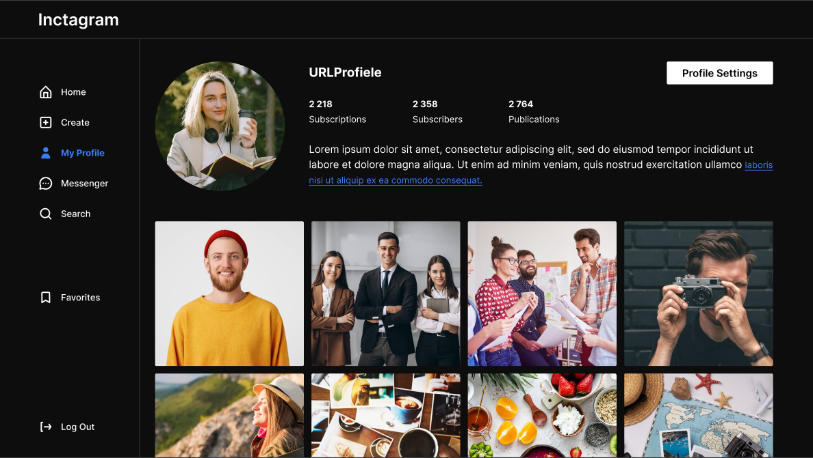

<h1 align="center">inctagram</h1>

<h2 align="center"></h2>

<p align="center">

[//]: # ''


</p>

<h2 align="center"><a  href="https://inctagram-woad.vercel.app">Live Demo</a></h2>

## 📝 Description

**Inctagram is a photo and video sharing social networking service.**


<p align="center">
  <a href="https://codesandbox.io">
    
  </a>
</p>


## 📝 About the project.

The app allows users to upload media that can be edited with filters and
organized by hashtags and geographical tagging. Posts can be shared publicly or
with preapproved followers. Users can browse other users' content by tag and location,
view trending content, like photos, and follow other users to add their content to
a personal feed.


## 💡 Technologies

<div align="left">
<a href="https://nextjs.org">

</a>
<a href="https://reactjs.org">

</a>
<a href="https://redux.js.org">

</a>
<a href="https://redux.js.org">

</a>
<a href="https://developer.mozilla.org/en-US/docs/Web/JavaScript">

</a>
<a href="https://www.typescriptlang.org">

</a>
<a href="https://sass-lang.com">

</a>
<a href="https://storybook.js.org">

</a>
<a href="https://jestjs.io/">

</a>
<a href="https://eslint.org/">

</a>

</div>


## 💻 Development


This project is developed using the Next.js library, along with various helper libraries
such as React Hook Form, Axios, RTK-Query, and Redux. In addition, we utilize Jest for unit testing,
and Storybook for documenting our UI components.

### 🛠️ Libraries and Tools

 - **NextJS:** We chose Next.js as the basis for our project because it provides us with powerful capabilities
for developing single page applications (SPAs) and statically generated sites (SSGs). 
Next.js provides fast page loading, easy page navigation, and server-side rendering.


 - **Redux**: We use the Redux library to manage the state of the application. 
Redux provides us with a centralized data store and powerful tools for managing application state. 
We can easily update state, dispatch actions, and bind components to store data.


 - **RTK-Query**: We use RTK-Query to simplify and standardize API work. 
It provides us with a convenient way to describe requests, handle responses, 
and cache data on the client side.


 - **React-hook-form**: To manage forms, we chose the React-hook-form library. 
It provides a convenient way to manage form state and validate input. 
React-hook-form helps us build powerful and flexible forms by making it easy to work with 
user input with minimal code.


 - **Storybook**: (not implemented yet) We use Storybook to document and showcase our UI components in an isolated and interactive manner.
With a Storybook, we can easily explore different component states, test edge cases, and maintain visual consistency
across our application. It serves as a valuable resource for both developers and designers.


 - **Jest**: We utilize Jest in our project to ensure the correctness and reliability of our codebase.
Its intuitive API, snapshot testing capabilities, and built-in code coverage reporting make it 
an excellent choice for testing our components and utility functions.


 - **SCSS**: For the convenience of laying out the application components,
we use the scss preprocessor. Using a preprocessor allows us to create more efficient and modular CSS
code with support for mixins and variables, improves development productivity, 
and makes it easier to maintain styles in the long run.


 - **ESLint**: ESLint helps us maintain a consistent coding style, identify potential bugs,
and apply best practices. With ESLint, our codebase adheres to a single set of coding standards, 
improving readability, maintainability, and collaboration among team members.


### ⚙️ Project setup dev server

```sh
npm install
npm next dev
```

#### use yarn

```sh
yarn
yarn next dev
```

#### create build and start

```sh
npm next build
npm next start
```

#### use yarn

```sh
yarn next build
yarn next start
```


### Requirements

To install and run the project, you need [NodeJS](https://nodejs.org/) v16.8+.


## 🔬 Tests

The project uses a jest framework for unit testing

```sh
npm run test
```


## 🔧 Future scope

- Paid account - Stripe, Paypall
- storybook component library

## 🤝 Team ✨

It was developed by these wonderful people

<!-- prettier-ignore-start -->
<!-- markdownlint-disable -->
<table>
  <tr>
    <td align="center">
      <a href="https://stemmy287.github.io/Portfolio/">
        
          <br />
            <sub><b>Eugene Lipatenko</b></sub>
      </a><br />
      <a href="https://github.com/Stemmy287" title="Code">💻</a>
    </td>
    <td align="center">
      <a href="https://pavlik1996.github.io/portfolio/">
        
          <br />
            <sub><b>Pavel Khrysto</b></sub>
      </a><br />
      <a href="https://github.com/Pavlik1996" title="Code">💻</a>
    </td>
    <td align="center">
      <a href="https://ggavr.github.io/portfolio/">
        
          <br />
            <sub><b>Gabriel</b></sub>
      </a><br />
      <a href="https://github.com/ggavr" title="Code">💻</a>
    </td>
    <td align="center">
      <a href="https://annaslivankova.github.io/my_portfolio/">
        
          <br />
            <sub><b>Hanna A. Slivankova</b></sub>
      </a><br />
      <a href="https://github.com/AnnaSlivankova" title="Code">💻</a>
    </td>
    <td align="center">
      <a href="https://msaserj.ru/">
        
          <br />
            <sub><b>Sergei Minko</b></sub>
      </a><br />
      <a href="https://github.com/msaserj" title="Code">💻</a>
    </td>
    <td align="center">
      <a href="https://github.com/zhanetfio">
        
          <br />
            <sub><b>Zhanet</b></sub>
      </a><br />
      <a href="https://github.com/zhanetfio" title="Code">💻</a>
    </td>
    <td align="center">
      <a href="https://github.com/chik1313">
        
          <br />
            <sub><b>Vladyslav</b></sub>
      </a><br />
      <a href="https://github.com/chik1313" title="Code">💻</a>
    </td>
</table>

<!-- markdownlint-enable -->
<!-- prettier-ignore-end -->


